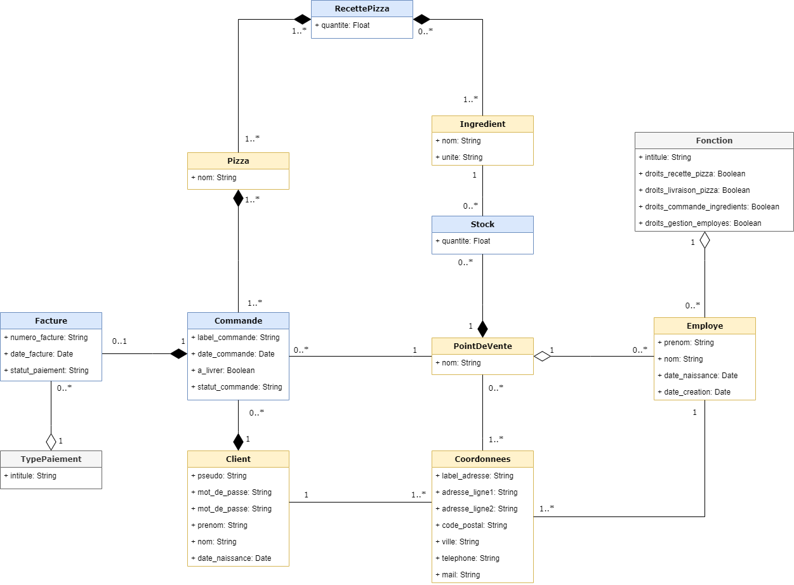
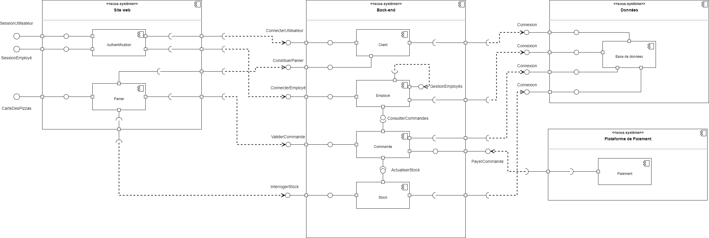
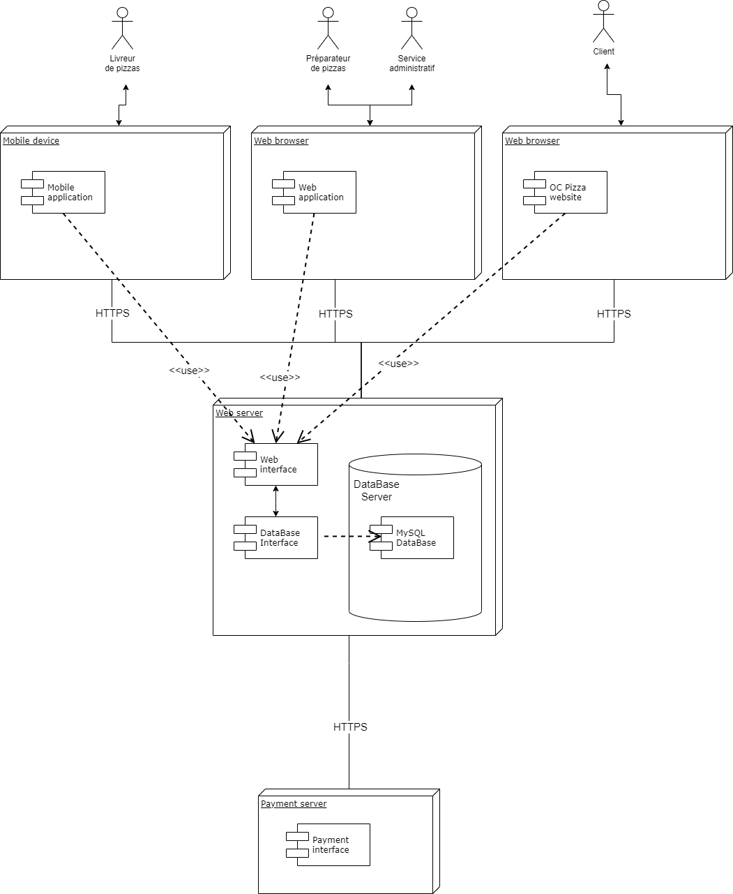

# Concevez la solution technique d'un système de gestion de pizzeria

Lien GitHub vers le projet : [OC_Projet5_API_MP](https://github.com/MickaPch/OC_Projet5_API_MP)

OpenClassrooms - Projet n°6 - Parcours *Développeur d'applications - Python*  
Auteur : [MickaP](https://github.com/MickaPch/)  

> *OC Pizza* est un jeune groupe de pizzerias en plein essor et spécialisé dans les pizzas livrées ou à emporter. Il compte déjà 5 points de vente et prévoit d'en ouvrir au moins 3 de plus d'ici la fin de l'année. Un des responsables a pris contact avec vous afin de mettre en place un système informatique, déployé dans toutes ses pizzerias et qui lui permettrait notamment :
* D'être plus efficace dans la gestion des commandes, de leur réception à leur livraison en passant par leur préparation
* De suivre en temps réel les commandes passées et en préparation
* De suivre en temps réel le stock d'ingrédients restants pour savoir quelles pizzas sont encore réalisables
* De proposer un site internet pour que les clients puissent :
    * Passer leurs commandes, en plus de la prise de commande par téléphone ou sur place
    * Payer en ligne leur commandes s'ils le souhaitent - sinon, ils paieront directement à la livraison
    * Modifier ou annuler leur commande tant que celle-ci n'a pas été préparée
* De proposer un aide-mémoire aux pizzaiolos indiquant la recette de chaque pizza
* D'informer ou notifier les clients sur l'état de leur commande

> Le client a déjà fait une prospection et les logiciels existants qu'il a pu trouver ne lui conviennent pas.

## Sommaire
* [Objectifs du projet](#objectifs_projet)
* [Spécifications techniques](#specifications_techniques)
    * [Description du domaine fonctionnel](#description_domaine_fonctionnel)
    * [Composants du système](#composants_système)
    * [Déploiement](#déploiement)
* [Modèle physique de données](#mpd)
* [Base de données MySQL](#bdd)

## Objectifs du projet
Définir le domaine fonctionnel et concevoir l'architecture technique d'un système de gestion de pizzerias en répondant aux besoins du client :
* Modéliser les objets du domaine fonctionnel
* Identifier les différents éléments composants le système à mettre en place et leurs interactions
* Décrire le déploiement des différents composants envisagés
* Elaborer le schéma de la ou les bases de données

## Spécifications techniques

### Description du domaine fonctionnel

[Lien vers les user stories & fonctionnalités](./app/resources/doc/user_stories.md)
L'analyse du domaine fonctionnel consiste à l'élaboration du diagramme de classes de l'architecture technique de notre projet.  
Le but du projet étant de modéliser un système informatique de gestion de pizzerias, le domaine fonctionnel est donc élaboré autour de 3 classes principales:
* *PointDeVente* : Lieu dans lequel la commande de pizzas est enregistrée et préparée
* *Commande* : Enregistrement de la commande et de ses informations
* *Client* : Personne qui passe commande auprès d'une des pizzerias du groupe  

Le système a besoin d'un certain nombre d'autres classes :
* *Facture* : classe héritée de la classe *Commande*. Enregistre les informations de paiement
* *TypePaiement* : Liste de toutes les solutions de paiement acceptées par les pizzerias du groupe
* *Pizza* : Carte des pizzas susceptibles d'êtres commandées par le client
* *Ingrédient* : Liste et quantité des ingrédients nécessaires à la fabrication d'une pizza
* *Stock* : Stock des ingrédients disponibles pour chaque pointe de vente
* *Employé* : Informations sur les employés et le pointe de vente dans lequel ils travaillent
* *Fonction* : Fonction exercée par l'employé, permet la gestion des droits dans la plateforme informatique
* *Coordonnées* : Coordonnées des points de vente, clients et employés

### Composants du système

La description des différents composants consiste à réaliser un diagramme de composants. Ils permettent de décrire le système modélisé sous forme de composants réutilisables et mettent en évidence leurs relations de dépendance.

### Déploiement

Le diagramme de déploiement décrit la disposition physique des ressources matérielles qui composent le système et montre la répartition des composants sur ces matériels. Chaque ressource étant matérialisée par un noeud, le diagramme de déploiement précise comment les composants sont répartis sur les noeuds et quelles sont les connexions entre les composants ou les noeuds.

## Modèle physique de données

Le modèle physique de données permet de construire la structure finale de la base de données avec les différents liens entre les éléments qui la composent.

## Base de données MySQL

Jeu de données de démonstration inspirée de personnages, adresses et coordonnées fictives.
La base de données est importable grâce à deux fichiers SQL :
* Script de création de la base de données
* Script d'import des données de démonstration